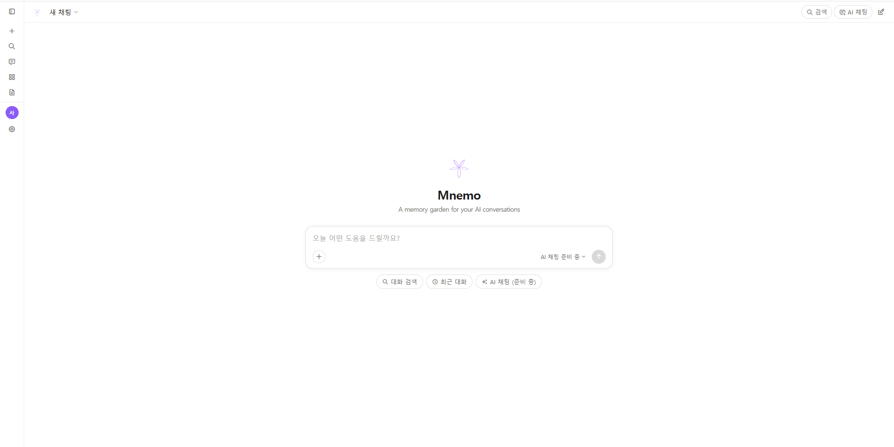

# Mnemo

Claude.ai 대화 내보내기 데이터를 브라우저에서 열람하고, 대화 내용을 기반으로 AI 채팅(RAG)을 제공하는 로컬 뷰어.



## 특징

- 완전 로컬 실행 — 외부 서버 없음
- Claude.ai 내보내기 JSON 파싱 및 렌더링
- 브랜치 대화 지원 (분기된 대화 시각화)
- RAG 기반 AI 채팅 (fastembed + Groq)
- 세션별 채팅 기록 저장/복원

## 설치

Python 3.10 이상 필요.

```bash
pip install -e .
```

## 설정

`.env.example`을 복사해 `.env`를 만들고 Groq API 키를 입력합니다.

```bash
cp .env.example .env
```

`.env` 파일:
```
GROQ_API_KEY=your_groq_api_key_here
```

Groq API 키는 [console.groq.com](https://console.groq.com)에서 발급받을 수 있습니다.

## 사용법

### 1. 대화 데이터 변환

Claude.ai에서 내보낸 `conversations.json`을 `raw_data/` 폴더에 넣고 파싱합니다.

```bash
python -m parser --input raw_data/conversations.json
```

### 2. 뷰어 실행

```bash
python -m viewer
```

브라우저가 자동으로 열립니다. 기본 포트는 8000.

```bash
python -m viewer --port 9000       # 포트 변경
python -m viewer --no-browser      # 브라우저 자동 실행 안 함
python -m viewer --data-dir PATH   # 데이터 디렉토리 직접 지정
```

### 3. RAG 평가 (선택)

```bash
python -m src.evaluator --session PATH --modes baseline
```

## 구조

```
├── raw_data/           Claude.ai 내보내기 파일 (conversations.json)
├── conversations/      파싱 결과 (자동 생성)
├── eval_data/          RAG 평가 결과 (자동 생성)
└── src/
    ├── parser.py           대화 데이터 파싱
    ├── models.py           데이터 스키마
    ├── server.py           HTTP 서버 + API
    ├── _groq.py            Groq API 래퍼
    ├── indexer.py          임베딩 + 벡터 검색
    ├── evaluator.py        RAG 평가 파이프라인
    └── viewer/
        ├── index.html
        ├── style.css
        ├── app.js          세션 목록 + 대화 렌더링
        ├── chat.js         AI 채팅 패널
        └── renderers/      블록 타입별 렌더러
```

## 라이선스

MIT
